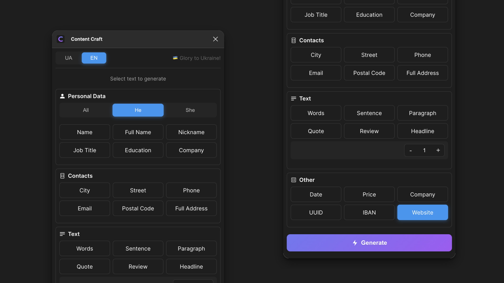

<div align="center">


# Content Craft

### 🎨 Потужний Figma плагін для генерації реалістичного контенту

[](https://www.figma.com/community/plugin/your-plugin-id)

[](README.md)
[](README_EN.md)

</div>

## ✨ Особливості

### 🌍 Підтримка Мов
- 🇺🇦 Українська
- 🇺🇸 Англійська (США)
- 🇫🇷 Французька
- 🇩🇪 Німецька

### 🎯 Можливості

| 🧑‍💼 Персональні Дані | 📍 Адреси | 💼 Бізнес | 📝 Контент | 🎲 Інше |
|-------------------|-----------|------------|------------|---------|
| Імена | Міста | Компанії | Заголовки | Нікнейми |
| Прізвища | Вулиці | Посади | Речення | UUID |
| Email | Індекси | IBAN | Параграфи | Освіта |
| Телефони | | Веб-сайти | Цитати | Ціни |

## 🚀 Швидкий Старт

1. **Встановлення**
   ```
   Figma → Plugins → Browse plugins → Content Craft → Install
   ```

2. **Використання**
   ```
   Виберіть текст → Запустіть Content Craft → Виберіть тип контенту → Generate
   ```

## 💫 Інтерфейс



## 🛠 Для Розробників

```bash
# Клонування
git clone https://github.com/artemsvit/Content-Craft.git

# Встановлення
cd Content-Craft && npm install

# Розробка
npm run watch
```

## 📝 Ліцензія

MIT © [Artem Svit](https://github.com/artemsvit)

<div align="center">

### Зроблено з ❤️ в Україні

</div>
