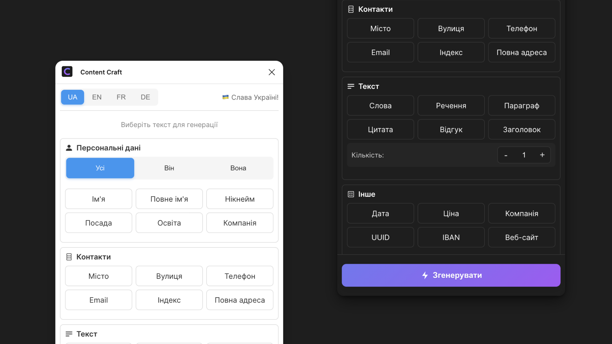

<div align="center">


# Content Craft

### 🎨 Інструмент для швидкого наповнення ваших макетів реалістичними даними

[](https://www.figma.com/community/plugin/1463946490049005195/content-craft)


[](https://www.figma.com/community/plugin/1463946490049005195/content-craft)

</div>

## ✨ Особливості

### 🎯 Можливості

| 🧑‍💼 Персональні Дані | 📍 Локації | 💼 Бізнес | 📝 Контент | 🎲 Інше |
|-------------------|-----------|-----------|------------|---------|
| Імена | Міста | Компанії | Заголовки | UUID |
| Прізвища | Вулиці | Посади | Речення | Дати |
| Email | Поштові індекси | IBAN | Параграфи | Ціни |
| Телефони | Повні адреси | Веб-сайти | Цитати | Освіта |
| Нікнейми | | | Відгуки | |
| Повні імена | | | Слова | |

## 🚀 Швидкий Старт

1. **Встановлення**
   ```
   Figma → Plugins → Browse plugins → Content Craft → Install
   ```

2. **Використання**
   ```
   Виберіть текст → Запустіть Content Craft → Виберіть тип контенту → Generate
   ```

## 💫 Інтерфейс



## 🛠 Для Розробників

```bash
# Клонування
git clone https://github.com/artemsvit/Content-Craft.git

# Встановлення
cd Content-Craft && npm install

# Розробка
npm run watch
```

## 📝 Ліцензія

MIT © [Artem Svit](https://github.com/artemsvit)

<div align="center">

### Зроблено з ❤️ в Україні

</div>
