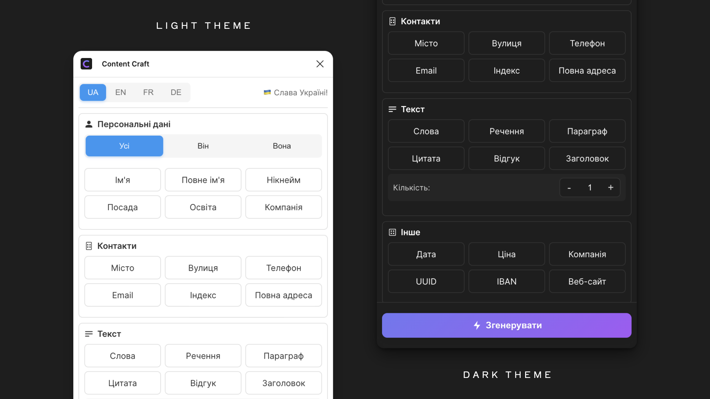
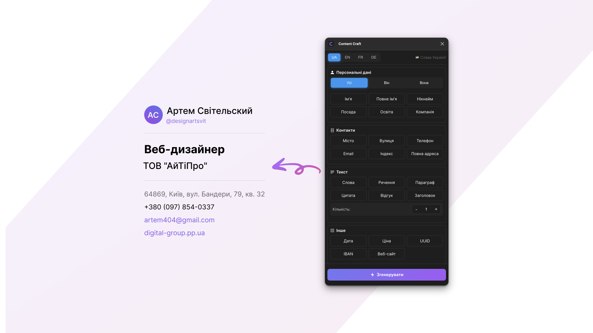

<div align="center">


# Content Craft 🎨

### 🚀 Інструмент для швидкого наповнення ваших макетів реалістичними даними

[](https://www.figma.com/community/plugin/1463946490049005195/content-craft)


[](https://www.figma.com/community/plugin/1463946490049005195/content-craft)

</div>

## ✨ Особливості

### 🛠️ Можливості

| 👤 Персональні Дані | 📍 Локації | 💼 Бізнес | 📝 Контент | 🔧 Інше |
|-------------------|-----------|-----------|------------|---------|
| 👱 Імена | 🏙️ Міста | 🏢 Компанії | 📰 Заголовки | 🔑 UUID |
| 👥 Прізвища | 🛣️ Вулиці | 👔 Посади | 📄 Речення | 📅 Дати |
| ✉️ Email | 📮 Поштові індекси | 💳 IBAN | 📑 Параграфи | 💰 Ціни |
| 📱 Телефони | 📍 Повні адреси | 🌐 Веб-сайти | 💭 Цитати | 🎓 Освіта |
| 🎮 Нікнейми | | | ⭐ Відгуки | |
| 📋 Повні імена | | | 📚 Слова | |

## 🚀 Швидкий Старт

1. **⚡ Встановлення**
   ```
   Figma → Plugins → Browse plugins → Content Craft → Install
   ```

2. **🎯 Використання**
   ```
   Виберіть текст → Запустіть Content Craft → Виберіть тип контенту → Generate
   ```

## 🖥️ Інтерфейс




## 👨‍💻 Для Розробників

```bash
# 📦 Клонування
git clone https://github.com/artemsvit/Content-Craft.git

# ⚙️ Встановлення
cd Content-Craft && npm install

# 🔧 Розробка
npm run watch
```

## 📄 Ліцензія

MIT [Artem Svit](https://github.com/artemsvit)

<div align="center">

### Зроблено з ❤️ в Україні 🇺🇦

</div>
